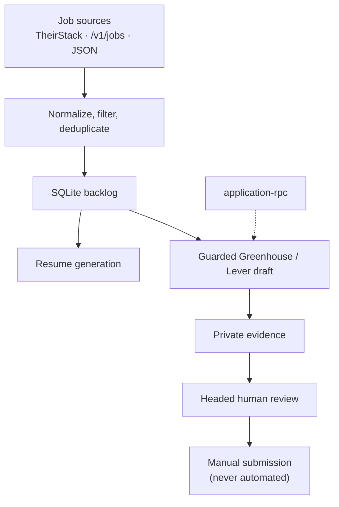

# jobs-assistant

Local-first job ingestion, resume generation, and guarded Greenhouse/Lever application-draft preparation.

> [!IMPORTANT]
> `jobs-assistant` never submits an application. It prepares a draft, persists private evidence, and stops for human review and manual submission.

The safety boundary is deterministic:

- Every browser mutation must pass an allow/deny gate against the current observation.
- LLM output is schema- and safety-validated before it can influence an action; raw output never controls the browser.
- Sensitive, legal, protected-class, financial, authentication, CAPTCHA, and assessment fields always remain manual.
- Unsupported ATS routes, ambiguous fields, and stale observations fail closed.
- SQLite data and per-run evidence remain local and owner-private.

## Key Capabilities

- **Multi-source ingestion:** import TheirStack results, normalized `/v1/jobs` feeds, or local JSON fixtures into a deduplicated SQLite backlog.
- **Grounded resume generation:** build job-specific resume artifacts from explicit, source-backed candidate claims.
- **Guarded application drafts:** fill supported safe fields on Greenhouse and Lever, then leave a headed window for human review.
- **Persistent RPC coordination:** run the same guarded application workflow through a bounded local JSONL service backed by OMP.
- **Private review evidence:** inspect observations, plans, actions, screenshots, and human annotations without exposing them in public CLI output.

## Architecture & Workflow



## Requirements

- Python 3.11+ and [`uv`](https://docs.astral.sh/uv/)
- Node.js 22.12+ and npm for the Puppeteer/OMP path
- Chrome installed through `npm run install-browser` for local browser-backed workflows
- Tectonic or `pdflatex` only when compiling standalone resume PDFs
- Docker and Docker Compose for the supported headless container smoke only; headed application workflows run on the host

## Quick Start

1. Install the locked Python environment:

   ```bash
   uv sync --frozen
   ```

2. Initialize the local database:

   ```bash
   uv run --frozen jobs-assistant init-db
   ```

3. Preview TheirStack matches without consuming paid-fetch credits:

   ```bash
   THEIRSTACK_API_KEY=your_key \
     uv run --frozen jobs-assistant theirstack-preview \
       --source-profile new_grad_cs
   ```

4. Explicitly authorize a paid fetch when ready:

   ```bash
   THEIRSTACK_API_KEY=your_key \
     uv run --frozen jobs-assistant theirstack-sync \
       --source-profile new_grad_cs \
       --paid-fetch \
       --limit 25
   ```

   `--limit` is the paid page size, not a total-credit cap. A sync may request up to 1,000 paid pages, stopping earlier when the validated result set is complete. Reaching the cap fails without persisting partial jobs, although earlier requests may already have consumed credits; review the ingestion guide before authorizing a paid fetch.

5. Install browser dependencies and prepare one guarded draft:
   Replace the profile placeholder with an owner-private application profile, or use a named preset as documented in [Application Drafts](docs/application-drafts.md#setup-and-autofill-flags).

   ```bash
   npm install
   npm run install-browser

   uv run --frozen jobs-assistant autofill \
     --ats auto \
     --headed \
     --resume-file resume/Main_Resume.pdf \
     --application-profile-json path/to/application-profile.json
   ```

6. After manually reviewing, submitting or skipping, and closing the headed window, record the outcome:

   ```bash
   uv run --frozen jobs-assistant autofill-review list
   # Replace 42 with the run ID returned by the list command.
   uv run --frozen jobs-assistant autofill-review complete \
     --run-id 42 \
     --outcome submitted \
     --confirm-window-closed
   ```

## Supported Sources and ATS Scope

- **TheirStack:** credit-safe preview plus explicitly authorized paid sync.
- **Normalized feeds:** local JSON or `GET /v1/jobs` through `import-feed`.
- **Greenhouse:** hosted job pages, hosted embed pages, and `grnh.se` short links that match the exact route policy.
- **Lever:** direct `jobs.lever.co` or `jobs.eu.lever.co` company/canonical-lowercase-UUID routes, optionally ending in `/apply`.

Unsupported hosts, credentials, fragments, invalid query parameters, noncanonical Lever UUIDs, cross-job redirects, and final-like routes are rejected before browser mutation.

## Command Index

| Surface | Command | Purpose |
|---|---|---|
| Primary CLI | `jobs-assistant init-db` | Initialize the SQLite backlog |
| Primary CLI | `jobs-assistant import-feed` | Import local JSON or a normalized HTTP feed |
| Primary CLI | `jobs-assistant theirstack-preview` | Preview matches without persisting jobs |
| Primary CLI | `jobs-assistant theirstack-sync` | Explicitly fetch and persist TheirStack jobs |
| Primary CLI | `jobs-assistant backlog-list` | Inspect backlog rows read-only |
| Primary CLI | `jobs-assistant backlog-show JOB_ID` | Show one job with a bounded plain-text description |
| Primary CLI | `jobs-assistant backlog-archive JOB_ID...` | Atomically archive selected queued rows |
| Primary CLI | `jobs-assistant autofill` | Prepare a guarded application draft |
| Primary CLI | `jobs-assistant application-rpc` | Serve the persistent local coordinator |
| Primary CLI | `jobs-assistant application-preferences` | Atomically edit safe mappings, opt-outs, and review order |
| Primary CLI | `jobs-assistant autofill-review` | List, inspect, complete, or retry human handoffs |
| Primary CLI | `jobs-assistant resume-generate` | Generate a grounded application-service resume artifact |
| Primary CLI | `jobs-assistant resume-show` | Show safe public details for one generated resume |
| Primary CLI | `jobs-assistant resume-list` | List generated resume artifacts |
| Compatibility CLI | `job-scrape` | Run the TheirStack sync entrypoint |
| Standalone CLI | `resume-generate` | Compile backlog-tailored LaTeX/PDF resumes |

## Resume Workflow Distinction

- **`resume-generate`:** standalone LaTeX/PDF generator using `resume/generator/` and writing separate artifacts under `data/generated-resumes-generator/`.
- **`jobs-assistant resume-generate`:** application-service generator using explicit profile/source-resume inputs and private artifacts under `data/generated-resumes/`.
- **`jobs-assistant autofill --resume-file`:** stages only the configured existing resume for a guarded application draft; it does not generate or silently replace that file.

The profile formats and artifact contracts are intentionally separate. See [Resume Generation](docs/resume-generation.md).

## Private Evidence and Human Review

Each claimed application run receives an owner-private directory under `data/application-runs/run-<id>/`. It contains the claim snapshot, observations, plans, actions, filled state, optional screenshots, and human annotations. `run.json` indexes artifacts by SHA-256 and records only a hash of any headed-handoff commit token.

A headed handoff is independently owned after durable evidence is committed. The person reviews the page, completes manual fields, decides whether to submit, closes the window, and records the outcome with `autofill-review`. No CLI or RPC operation performs the final submission.

## Documentation

| Guide | Contents |
|---|---|
| [Job Ingestion and Backlog](docs/ingestion.md) | TheirStack credit controls, normalized feeds, deduplication, and backlog operations |
| [Application Drafts](docs/application-drafts.md) | ATS routes, deterministic gates, profiles, preferences, evidence, and review |
| [Application RPC](docs/application-rpc.md) | JSONL lifecycle, OMP boundary, allowed tools, and headed handoff |
| [Resume Generation](docs/resume-generation.md) | Standalone and application-service resume contracts |
| [Operations](docs/operations.md) | Environment, private filesystem rules, browser diagnostics, containers, and verification |

Additional project references:

- [Roadmap and active gaps](TODO.md)
- [OMP orchestration development workflow](OMP_CMUX_WORKFLOW.md)
- [Environment variable template](.env.example)

## Verification

```bash
uv lock --check
uv run --frozen --extra dev python -m pytest
sh scripts/smoke.sh
npm run puppeteer-smoke
npm run puppeteer-verify
sh scripts/container-smoke.sh
```

`npm run puppeteer-verify` is a host check and includes a headed local diagnostic. It excludes the two physical headed-handoff checks, which remain manual checks requiring a benign human click and tab/window close.
